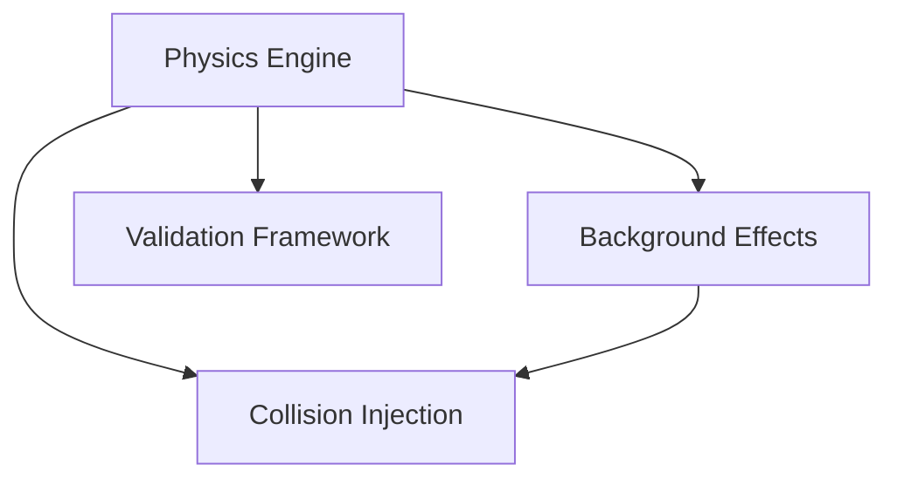

# 🛡️ Flyby Fingerprints: Simulation-First Collision Detection Framework

[](https://mybinder.org/v2/gh/uwarring82/-flyby-fingerprints-sandbox/HEAD?labpath=notebooks%2FBackground_Model_Explorer.ipynb)
[](https://mybinder.org/v2/gh/uwarring82/-flyby-fingerprints-sandbox/HEAD?urlpath=voila/render/notebooks/Background_Model_Explorer_APP.ipynb)

> **Critical Notice**  
> This project is **simulation-first**. Analysis of real data is **gated** by Guardian certification of the simulation + validation stack. PRs into `main` require the **Guardian Validation** CI check to pass.


## 🎯 Mission
Detect weak residual-gas collisions in trapped-ion systems via rigorously validated fingerprint analysis—starting with a comprehensive simulation of all known background/systematic effects.

## 🏗️ Three-Phase Architecture

- **Phase 1: Simulation Backend (ACTIVE) ✅**  
  Trapped-ion dynamics (target <0.1% deviation), Tier-1..3 background models, preliminary collision-injection API, Guardian validation framework (ROC, null testing).
- **Phase 2: Algorithm Development (GATED) 🔗**  
  Requires certified Phase-1. A-D-M triad pipeline and Heptad analysis.
- **Phase 3: Real Data Analysis (GATED) 🔗**  
  Requires certified Phase-2. Historical re-analysis, new campaigns, community portal.

> **GATED = dependent on prior certified phase.** Work may proceed on feature branches but **cannot merge to `main`** until certification passes.

## 🚀 Quick Start

**Python:** 3.11 (tested)

### Quick setup
```bash
# Conda (recommended)
conda env create -f environment.yml
conda activate flyby

# or: pip
python -m venv .venv && source .venv/bin/activate
pip install -r requirements.txt
# (optional) install package in editable mode
pip install -e .
```

Launch the Background Model Explorer

```bash
jupyter lab notebooks/Background_Model_Explorer.ipynb
```

### Interactive / Notebooks

#### Run a background simulation from CLI

```bash
python scripts/run_background_sim.py \
  --T 300 --rf_rms 1.0 --mains 60 --em_coupling 0.002 \
  --patch 20 --corr 200 --cps 500 --tint 2.0 \
  --n_samples 20000 --dt 1e-4 --seed 42
```

Outputs appear in artifacts/simulations/:
- <stamp>_time_series.png, <stamp>_psd.png, <stamp>_allan.png
- <stamp>_guardian_report.json, <stamp>_config.json
- <stamp>_overview.html (open in a browser for a quick gallery view)

Preview the results by opening the generated HTML overview (replace with your
timestamp):

```bash
python -m webbrowser artifacts/simulations/20250101T120000_overview.html
```

The page embeds the three plots and inlines the Guardian JSON summary so you
can review everything without hunting for individual files.

#### One-shot verification

```bash
# Create/refresh environment
conda env remove -n flyby -y || true
conda env create -f environment.yml
conda activate flyby

# Run the plotting script with typical parameters
python scripts/run_background_sim.py \
  --T 300 --rf_rms 1.0 --mains 60 --em_coupling 0.002 \
  --patch 20 --corr 200 --cps 500 --tint 2.0 \
  --n_samples 20000 --dt 1e-4 --seed 42
```

### Physicists
```bash
git clone https://github.com/uwarring82/-flyby-fingerprints-sandbox
cd flyby-fingerprints-sandbox
python -m simulations.validation.guardian_gates  # if present
```

Algorithm Developers

```
# NOTE: Collision injection API is preliminary and may change pending backend completion.
from simulation_backend import api as sim
data, gt = sim.generate_background_only_with_markers()
# Implement your detector; compare to markers/gt.
```

Experimentalists
•See /docs/systematic_effects.md for the effect catalog and contribution hooks.
•Open an issue with your trap parameters to prioritize validation targets.

📊 Status Dashboard

### Status Dashboard

Last updated: 2025-09-25T14:00:00Z · [Provenance](./STATUS.md)

- **Physics Engine** — **In Review** (~60%) — **Owner:** @uwarring82 — **Risk:** Medium<br>
  **Next milestone:** Coulomb precision sweep & integrator validation (tests under `tests/physics/`)<br>
  **Notes:** Target <0.1% deviation on analytic benchmarks; prep for adaptive step control.

- **Background Effects** — **Active** (~50%) — **Owner:** @uwarring82 — **Risk:** High<br>
  **Next milestone:** Tier-2 drift & RF pickup model calibration; finalize `systematic_effect_analysis.py` (PSD + Allan)<br>
  **Notes:** **Background Model Explorer** live via Binder (see badges below); Guardian null-95 & SNR wiring in place.

- **Collision Injection** — **Pending** (~15%) — **Owner:** @uwarring82 — **Risk:** High<br>
  **Next milestone:** Stabilize injection I/O schema with ground-truth tags; add `examples/run_collision_injection.py`<br>
  **Notes:** Blocked on Physics + Background partial certification; start with Tier-1 backgrounds.

- **Validation Framework** — **In Review** (~40%) — **Owner:** @uwarring82 — **Risk:** Medium<br>
  **Next milestone:** Expand null-hypothesis regression coverage; wire ROC/AUC harness into CI Guardian gate<br>
  **Notes:** `guardian_background_validator.py` aggregates inventory, null-95, and SNR≥10 checks.



Guardian Requirements (merge gates)
• Physics deviation target: < 0.1% (tracked tests)
• Tier-1..3 backgrounds modeled with tests & bounds
• Ground-truth preservation in I/O and APIs
• ROC AUC > 0.95 at 10:1 SNR (sim suites)
• PRs → CI Guardian Validation must pass

See STATUS.md for details and history.

Run `python scripts/guardian-cli.py --summary-json` for a local snapshot; add
`--strict` when pending checks should block merges instead of surfacing as
warnings.

🤝 Contributing

Start with CONTRIBUTING.md. Choose your path:
•Simulation (physics fidelity, performance)
•Validation (tests, ROC/Null suites, Guardian)
•Documentation (effect catalog, tutorials)

📚 Learn More
•/docs/architecture_overview.md
•/docs/systematic_effects.md
•/docs/guardian_framework.md
•Project docs site (when enabled): see badge/link in STATUS.md

Repository Principle:
Every unvalidated systematic effect is a potential false discovery waiting to happen.
