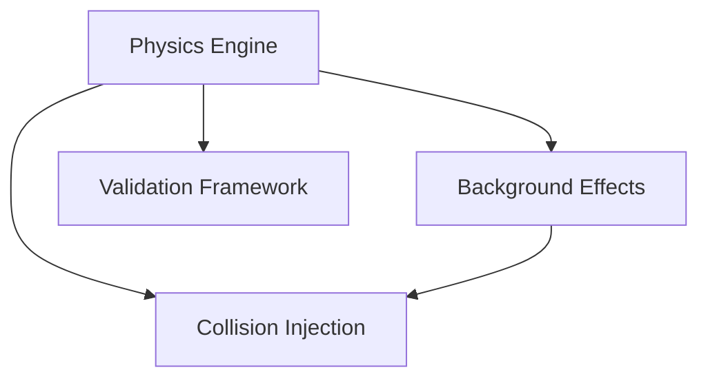

# 🛡️ Flyby Fingerprints: Simulation-First Collision Detection Framework

> **Critical Notice**  
> This project is **simulation-first**. Analysis of real data is **gated** by Guardian certification of the simulation + validation stack. PRs into `main` require the **Guardian Validation** CI check to pass.


## 🎯 Mission
Detect weak residual-gas collisions in trapped-ion systems via rigorously validated fingerprint analysis—starting with a comprehensive simulation of all known background/systematic effects.

## 🏗️ Three-Phase Architecture

- **Phase 1: Simulation Backend (ACTIVE) ✅**  
  Trapped-ion dynamics (target <0.1% deviation), Tier-1..3 background models, preliminary collision-injection API, Guardian validation framework (ROC, null testing).
- **Phase 2: Algorithm Development (GATED) 🔗**  
  Requires certified Phase-1. A-D-M triad pipeline and Heptad analysis.
- **Phase 3: Real Data Analysis (GATED) 🔗**  
  Requires certified Phase-2. Historical re-analysis, new campaigns, community portal.

> **GATED = dependent on prior certified phase.** Work may proceed on feature branches but **cannot merge to `main`** until certification passes.

## 🚀 Quick Start

### Physicists
```bash
git clone https://github.com/uwarring82/-flyby-fingerprints-sandbox
cd flyby-fingerprints-sandbox
python -m venv .venv && source .venv/bin/activate
pip install -r requirements.txt
python -m simulations.validation.guardian_gates  # if present
```

Algorithm Developers

```
# NOTE: Collision injection API is preliminary and may change pending backend completion.
from simulation_backend import api as sim
data, gt = sim.generate_background_only_with_markers()
# Implement your detector; compare to markers/gt.
```

Experimentalists
•See /docs/systematic_effects.md for the effect catalog and contribution hooks.
•Open an issue with your trap parameters to prioritize validation targets.

📊 Status Dashboard

<!-- DASHBOARD:BEGIN -->
<!-- (autogenerated, do not edit) -->

### Status Dashboard
**Last updated:** 2025-09-24T10:48:17Z · _Provenance pending_

- 🟡 In Review **Physics Engine** (~60%) — Owner: @uwarring82 • Risk: Medium • ETA: 2024-06-15 • Dependencies: None • Next milestone: #101
- 🟡 Pending **Background Effects** (~40%) — Owner: @tess.alvarez • Risk: High • ETA: 2024-07-05 • Dependencies: Physics Engine • Next milestone: #102
- 🔴 Blocked **Collision Injection** (~10%) — Owner: @marco.chen • Risk: High • ETA: 2024-08-01 • Dependencies: Physics Engine, Background Effects • Next milestone: #103
- 🟡 In Review **Validation Framework** (~30%) — Owner: @priya.nair • Risk: Medium • ETA: 2024-06-30 • Dependencies: Physics Engine • Next milestone: #104



| Module | Risk | Driver | Mitigation |
| --- | --- | --- | --- |
| Physics Engine | Medium | Coulomb precision tuning requires HPC optimization | Schedule GPU acceleration sprint and validate results against analytic benchmarks |
| Background Effects | High | Tier-2 drift model lacks calibration data | Acquire calibration runs and extend Guardian synthetic suites |
| Collision Injection | High | Stable API contract pending validation feedback | Align API schema with validation framework and add integration tests |
| Validation Framework | Medium | ROC harness lacks null-hypothesis regression coverage | Expand null test suites and enforce Guardian thresholds in CI |
<!-- DASHBOARD:END -->

See STATUS.md for details.

🛡️ Guardian Requirements (merge gates)
•Physics deviation target: < 0.1% (tracked tests).
•Tier-1..3 backgrounds modeled with tests & bounds.
•Ground-truth preservation in I/O and APIs.
•ROC AUC > 0.95 at 10:1 SNR (sim suites).
•PRs → CI Guardian Validation must pass.

Run `python scripts/guardian-cli.py --summary-json` for a local snapshot; add
`--strict` when pending checks should block merges instead of surfacing as
warnings.

🤝 Contributing

Start with CONTRIBUTING.md. Choose your path:
•Simulation (physics fidelity, performance)
•Validation (tests, ROC/Null suites, Guardian)
•Documentation (effect catalog, tutorials)

📚 Learn More
•/docs/architecture_overview.md
•/docs/systematic_effects.md
•/docs/guardian_framework.md
•Project docs site (when enabled): see badge/link in STATUS.md

Repository Principle:
Every unvalidated systematic effect is a potential false discovery waiting to happen.
