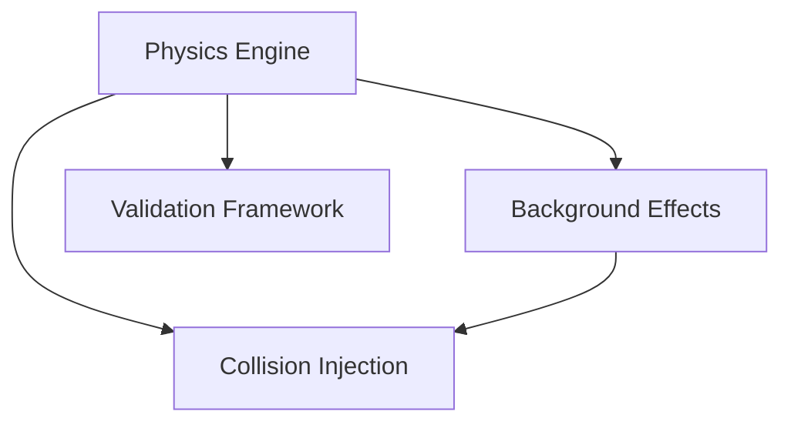

# Project Status

<!-- DASHBOARD:BEGIN -->
<!-- (autogenerated, do not edit) -->

### Status Dashboard
**Last updated:** 2025-09-24T10:48:17Z · _Provenance pending_

- 🟡 In Review **Physics Engine** (~60%) — Owner: @uwarring82 • Risk: Medium • ETA: 2024-06-15 • Dependencies: None • Next milestone: #101
- 🟡 Pending **Background Effects** (~40%) — Owner: @tess.alvarez • Risk: High • ETA: 2024-07-05 • Dependencies: Physics Engine • Next milestone: #102
- 🔴 Blocked **Collision Injection** (~10%) — Owner: @marco.chen • Risk: High • ETA: 2024-08-01 • Dependencies: Physics Engine, Background Effects • Next milestone: #103
- 🟡 In Review **Validation Framework** (~30%) — Owner: @priya.nair • Risk: Medium • ETA: 2024-06-30 • Dependencies: Physics Engine • Next milestone: #104

| Module | Risk | Driver | Mitigation |
| --- | --- | --- | --- |
| Physics Engine | Medium | Coulomb precision tuning requires HPC optimization | Schedule GPU acceleration sprint and validate results against analytic benchmarks |
| Background Effects | High | Tier-2 drift model lacks calibration data | Acquire calibration runs and extend Guardian synthetic suites |
| Collision Injection | High | Stable API contract pending validation feedback | Align API schema with validation framework and add integration tests |
| Validation Framework | Medium | ROC harness lacks null-hypothesis regression coverage | Expand null test suites and enforce Guardian thresholds in CI |
<!-- DASHBOARD:END -->

## Guardian Gate Policy

- The `Guardian Validation` workflow is a required status check for `main` merges; branch protection must keep it enabled.
- Guardian artifacts, including `guardian_summary.json`, are preserved for provenance and dashboard regeneration.
